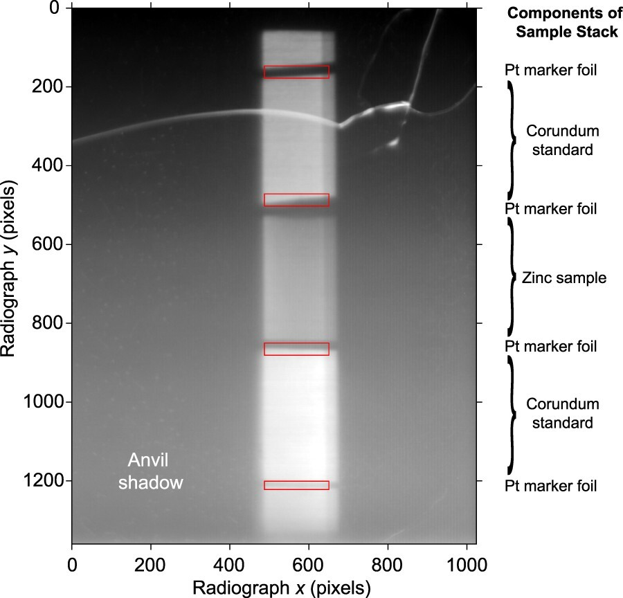

***Figure:*** *Example X-radiograph from the high pressure synchrotron experiment used to validate the software algorithms in this study. The dark areas at either side of the image are the shadows of the tungsten carbide anvils and the samples are observed in the bright central stripe. The red boxes are the positions of the regions of interest tracked between images. The scale of the image is 2 μm/pixel.*

## Download

- [Online](https://www.tandfonline.com/doi/full/10.1080/08957959.2023.2247542)
- [Paper](paper.pdf)

## Abstract

In high pressure multi-anvil experiments X-radiography is used to ascertain strain in deforming samples because the tooling prevents optical or other direct observations of the sample. The processing of these X-radiographic images to determine bulk sample strain is one of the limiting factors to making measurements closer to the strains and strain-rates that occur during mantle convection or the passage of seismic waves. Typically, sample deformation in these experiments is tracked by the displacement of high-contrast marker foils in X-radiographs. X-radiographs are treated individually or pairwise in a multi-step process that tracks the displacement of marker foils during experiments. Here I develop a new algorithm, FoilTrack, that treats all the X-radiographic observations in a single-step process, resulting in improved accuracy and consistency of length changes determined from X-radiographic images, as well as providing more realistic parameter uncertainty. The improvements are demonstrated using data from small-strain sinusoidal deformation experiments.

## Acknowledgement

SAH thanks Andrew Walker for discussion and encouragement.

## Data Availability

The source code is available on GitHub at [https://github.com/S-Hunt/FoilTrack](https://github.com/S-Hunt/FoilTrack). The full data set processed here is available from [https://www.bgs.ac.uk/discoverymetadata/13607352.html](https://www.bgs.ac.uk/discoverymetadata/13607352.html).

---

## Citation

```latex
@article{hunt2023foiltrack,
  title={FoilTrack: a package to increase strain-resolution by improved X-radiographic image processing},
  author={Hunt, Simon A},
  journal={High Pressure Research},
  volume={43},
  number={4},
  pages={263--278},
  year={2023},
  publisher={Taylor \& Francis},
  doi={10.1080/08957959.2023.2247542}
}
```
