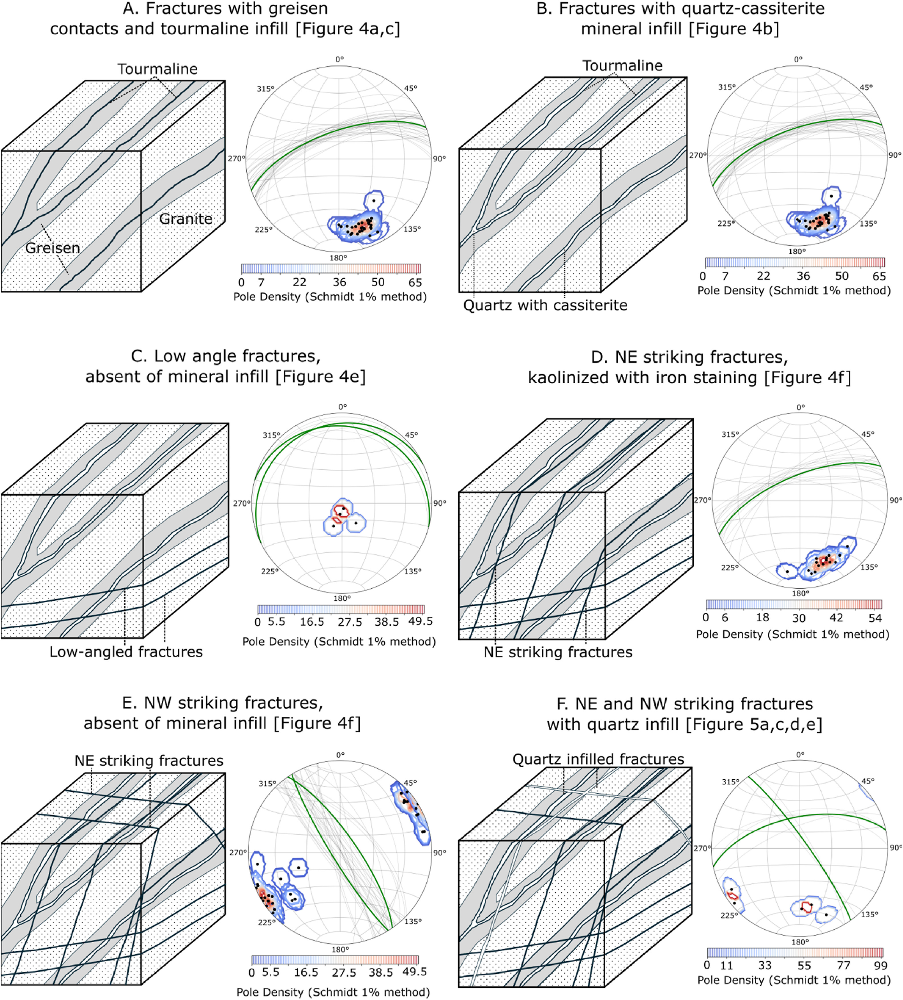

***Figure:*** *Schematic evolution of fractures at the exposed Cligga Head granite as interpreted from younging tables. Each phase of fracturing is represented as a block model complimented with an equal area stereonet. The mean fracture plane is plotted in green with pole density calculated using the Schmidt 1% method.*

## Download

- [Online](https://www.sciencedirect.com/science/article/pii/S0191814125001853#abs0010)
- [Paper](paper.pdf)

## Abstract

Fracture systems within low-permeability crystalline granitic rocks are critical pathways for fluid flow within these bodies. Constraining the sequence of mineralisation in fracture sets is key to effectively determining the mineral potential and exploitability of rare and critical metals within granite bodies. This study presents the results of a field fracture analysis at the greisen-bearing, lithium-rich Cligga Head granite---a satellite granitic body of the Cornubian Batholith in southwest England. Field mapping of the well-exposed granite body, younging tables and scanning electron microscopy (SEM) are used to develop a temporal model for the evolution of fractures in the Cligga Head granite. Seven fracture sets with varying mineral infill were identified. These fractures exhibit a sequence of cross-cutting relationships that broadly correspond to regional lineament trends---associated with the Variscan Orogeny. As high-quality granite exposure in the region is limited, detailed fracture analysis of satellite granite bodies like Cligga Head provides valuable context for regional critical mineral exploration.

## Acknowledgement

We thank the Perranzabuloe Parish Council for permission to work and sample at Cligga Head. We are grateful to Robin Shail, Chris Yeomans, Hugh Heard, David Manning and David McNamara for valuable discussions on Cornish geology and field locations. We further acknowledge the assistance of Nuffield Research Placement students Amber Wells and Heidi Burgham in SEM image collection. Finally, we thank Adam Cawood and two anonymous reviewers for their constructive comments which greatly enhanced the quality of the manuscript.

## Data Availability

All field and experimental data relating to this study are available at [https://doi.org/10.48420/28553645.v2](https://doi.org/10.48420/28553645.v2).

---

## Citation

```latex
@article{evans2025fracture,
  title={Fracture analysis of the lithium-bearing Cligga Head granite: impacts on critical mineral mobilisation and fluid flow},
  author={Evans, Andrew JM and Farrell, Natalie JC and Neave, David A and Hartley, Margaret E and Healy, David and Waters, John P and McElhinney, Tara R and Shea, Joshua J and Bigaroni, Nico and Hunt, Simon A},
  journal={Journal of Structural Geology},
  pages={105510},
  year={2025},
  publisher={Elsevier},
  doi={10.1016/j.jsg.2025.105510}
}
```
