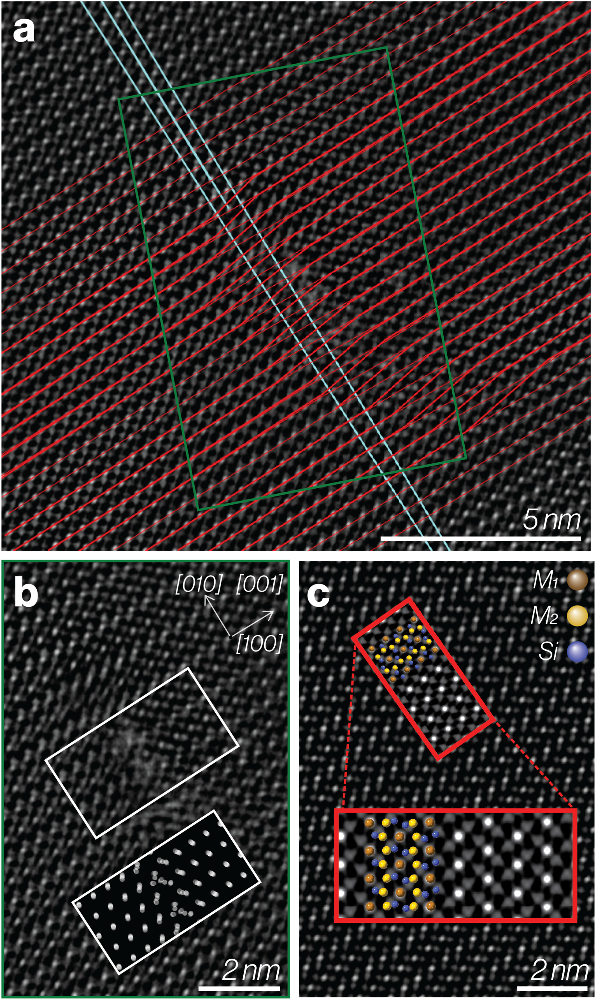

***Figure:*** *Atomic resolution STEM characterization of b dislocations in olivine. (a) Atomic-resolution ADF-STEM image of b dislocation in olivine with (020) planes highlighted in red and extra half plane related to a separate edge dislocation in blue. (b) Magnified image of central part and model of M1 positions in the dislocation inset at bottom, matching the white rectangle. (c) Atomic-resolution image of defect-free olivine with (insets) atomic columns identified using known positions and simulated ADF image.*

## Download

- [Online](https://agupubs.onlinelibrary.wiley.com/doi/full/10.1029/2025GL117138)
- [Paper](paper.pdf)

## Abstract

When deformed by dislocation creep the dominant slip (Burgers) vectors of olivine dislocations are parallel to [100] or [001]. Dislocations with an [010] Burgers vector component (b dislocations) have been recorded rarely. Here we show an experimentally deformed olivine sample has a substantial population (17%) of b dislocations. Electron Backscatter Diffraction maps of crystal orientations provided information on dislocations from the orientation gradients. Maps show the b dislocations form subgrain walls like those formed by other dislocation types and are interpreted to form similarly by glide and climb, so b dislocations are mobile. To confirm our approach, we used Electron Backscatter Diffraction maps to select an area for Transmission Electron Microscopy imaging, down to an atomic scale image of a b dislocation. Our sample was deformed within range of subduction zone conditions; our approach can be used to investigate the scale and conditions of b slip in the mantle more widely.

## Acknowledgement

J. Wheeler and S. Hunt were funded by NERC Grant NE/V018477/1. Y. Li acknowledges technical support from David Hall and financial support by the EPSRC (Grant EP/S028978/1 and EP/V053183/1). TEM and FIB access were supported by the Henry Royce Institute for Advanced Materials, funded through EPSRC Grants EP/R00661X/1, EP/S019367/1, EP/P025021/1 and EP/P025498/1, and further EPSRC Grant EP/S021531/1. We thank H. Jung and an anonymous reviewer for their inputs and F. Capitanio and M. Ramil for their editorial contributions.

## Data Availability

EBSD data for the main and inset maps are in Wheeler et al. ([2025](https://doi.org/10.5281/zenodo.17493851)). Software supporting this research is available in the “Dislocation Analysis” module of Aztec Crystal from Oxford Instruments. It is available as Matlab closed source code (“Crystalscape”) for academic use only; a legal agreement with Oxford Instruments excludes commercial use. Academic researchers can gain access on request via Zenodo (Wheeler, [2025](https://doi.org/10.5281/zenodo.15465607)).

---

## Citation

```latex
@article{wheeler2025olivine,
  title={Olivine deformation: To b slip or not to b slip, that is the question},
  author={Wheeler, John and Hunt, Simon and Eggeman, Alex and Donoghue, Jack and Gholinia, Ali and Li, Yizhe and Tillotson, Evan and Haigh, SJ},
  journal={Geophysical Research Letters},
  volume={52},
  number={24},
  pages={e2025GL117138},
  year={2025},
  publisher={Wiley Online Library},
  doi={10.1029/2025GL117138}
}
```
