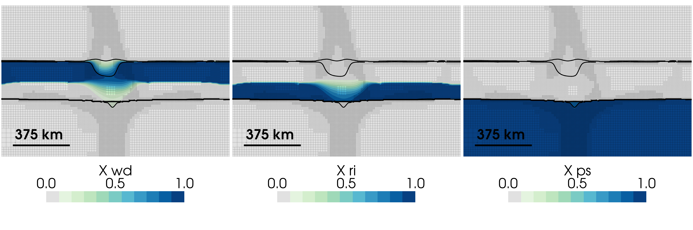

***Figure:*** *Slab simulations with sluggish olivine $\Leftrightarrow$ wadsleyite $\Leftrightarrow$ ringwoodite kinetics, and fast ringwoodite $\Leftrightarrow$ postspinel kinetics after 100 Ma evolution. Panels show the volume fraction $X$ of wadsleyite (left), ringwoodite (middle), and the postspinel assemblage (right). Thin lines highlight the 10% and 90% volume fraction contours ($X$ = 0.1 and 0.9) which outline the 410 and 660 km discontinuities.*

## Download

Pending.

## Abstract

The 660 km seismic discontinuity ('660') varies beneath subduction zones, ranging from modest depressions consistent with equilibrium thermodynamics to anomalously deep, broad transitions challenging purely thermal interpretations. Laboratory experiments establish that the ringwoodite decomposition responsible for the 660 proceeds via diffusion-controlled kinetics, yet their quantitative effects on 660 structure and slab dynamics have not been evaluated in compressible mantle flow simulations. We couple ringwoodite decomposition kinetics to simulations of mantle plumes and subducting slabs, varying kinetic parameters across six orders of magnitude. Results reveal a fundamental asymmetry between hot and cold environments. In plumes, elevated temperatures produce uplifted, narrow 660s that are relatively insensitive to kinetics due to rapid reaction rates. In slabs, kinetics exert strong control through three regimes: 1) a quasi-equilibrium regime producing 660s consistent with Clapeyron-slope predictions; 2) an intermediate regime where metastable ringwoodite accumulates within a broadening buoyant zone, slowing slab descent; and 3) a stagnation regime where slabs pond above the 660, producing the deepest, broadest 660s and slowest descent velocities. The endothermic Clapeyron slope and kinetic inhibition reinforce each other, amplifying temperature-driven 660 deflection by a factor of 2--4 while independently promoting slab stagnation. Slabs smoothly transition through each regime as reaction rates slow, without abrupt reactions at overstepped metastable conditions. These findings establish ringwoodite kinetics as a first-order control on slab stagnation dynamics and 660 seismic structure under Earth-like conditions, explaining the diverse slab behaviors observed at the base of the mantle transition zone.

## Acknowledgement

This work was funded by the UKRI NERC Large Grant no. NE/V018477/1. All computations were undertaken on Barkla2, part of the High Performance Computing facilities at the University of Liverpool, who graciously provided expert support. We thank the Computational Infrastructure for Geodynamics ([https://geodynamics.org](https://geodynamics.org)) which is funded by the National Science Foundation under awards EAR-0949446 and EAR-1550901 for supporting the development of ASPECT.

## Data Availability

All data, code, and relevant information for reproducing this work are archived on the OSF ([Kerswell, 2026a](https://doi.org/10.17605/OSF.IO/KUR93)) and Zenodo ([Kerswell, 2026b](https://doi.org/10.5281/zenodo.21810741)) repositories. All code within these repositories is MIT Licensed and free for use and distribution (see license details). ASPECT version 3.0.0 ([Bangerth et al., 2024](https://doi.org/10.5281/zenodo.14371679)) was used for the computations in this study and is freely available under the GPL v2.0 or later license.

---

## Citation

Pending.
