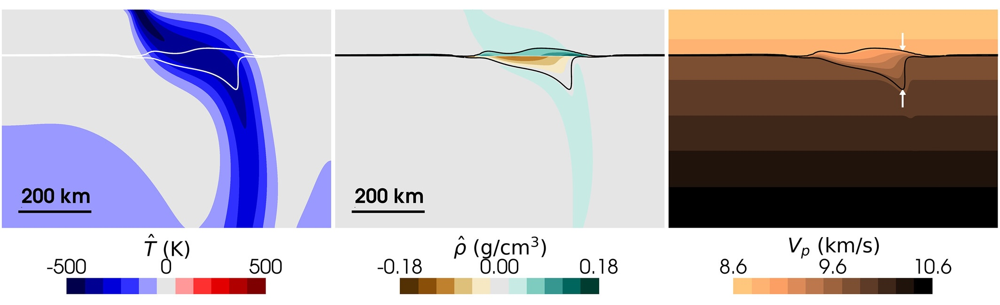

***Figure:*** *Slab simulations with moderately sluggish olivine $\Leftrightarrow$ wadsleyite kinetics after 100 Ma evolution. Panels show dynamic temperature $\hat{T}$ (left), dynamic density $\hat{\rho}$ (middle), and pressure-wave velocity $V_p$ (right). Thin lines highlight the 10% and 90% wadsleyite volume fraction contours ($X$ = 0.1 and 0.9). The 410 displacement is defined as the difference between the depth at X = 0.9 and the nominal equilibrium olivine $\Leftrightarrow$ wadsleyite transition depth, while the 410 width is defined as the difference between depths at X = 0.9 and X = 0.1 (see Supplementary Information for details). The white arrows (right) indicate where the 410 structure was measured.*

## Download

- [Online](https://agupubs.onlinelibrary.wiley.com/doi/10.1029/2026JB033781)
- [Paper](paper.pdf)

## Abstract

The seismic expression of Earth's 410 km discontinuity varies across tectonic settings, from sharp, high-amplitude interfaces to broad transitions---patterns that cannot be explained by equilibrium thermodynamics without invoking large-scale thermal or compositional heterogeneities. Laboratory experiments show the olivine $\Leftrightarrow$ wadsleyite transition responsible for the 410 is rate-limited, yet previous numerical studies have not directly evaluated the sensitivity of 410 structure to kinetic and rheological factors. Here we investigate these relationships by coupling a grain-scale, interface-controlled olivine $\Leftrightarrow$ wadsleyite growth model to compressible simulations of mantle plumes and subducting slabs. We vary kinetic parameters across seven orders of magnitude and quantify the resulting 410 displacements and widths. Our results reveal an asymmetry between hot and cold environments. In plumes, high temperatures produce sharp 410s (2--3 km wide) regardless of kinetics. In slabs, kinetics exert first-order control on 410 structure through three regimes: (1) quasi-equilibrium conditions producing narrow, uplifted 410s and continuous slab descent; (2) intermediate reaction rates generating broader, deeper 410s with metastable olivine wedges resisting downward slab motion; and (3) ultra-sluggish reaction rates causing slab stagnation with re-sharpened, deeply displaced 410s ($\lesssim$ 100 km). Rheological contrasts modulate these kinetic effects by controlling slab geometry and residence time in the phase transition zone. These findings demonstrate that reaction rates strongly influence 410 structure in subduction zones, establishing the 410 as a potential seismological constraint on upper mantle kinetic processes, particularly in cold environments where disequilibrium effects are amplified.

## Acknowledgement

This work was funded by the UKRI NERC Large Grant no. NE/V018477/1. All computations were undertaken on Barkla2, part of the High Performance Computing facilities at the University of Liverpool, who graciously provided expert support. We thank the Computational Infrastructure for Geodynamics ([https://geodynamics.org](https://geodynamics.org)) which is funded by the National Science Foundation under award EAR-0949446 and EAR-1550901 for supporting the development of ASPECT. We also extend our gratitude towards Sujoy Ghosh for his editorial handling, and two anonymous reviewers for their constructive feedback that improved the manuscript.

## Data Availability

All data, code, and relevant information for reproducing this work are archived on the OSF ([Kerswell, 2026a](https://doi.org/10.17605/OSF.IO/9PHWC)) and Zenodo ([Kerswell, 2026b](https://doi.org/10.5281/zenodo.19662566)) repositories. All code within these repositories is MIT Licensed and free for use and distribution (see license details). ASPECT version 3.0.0 ([Bangerth et al., 2024](https://doi.org/10.5281/zenodo.14371679)) was used for the computations in this study and is freely available under the GPL v2.0 or later license.

---

## Citation

```latex
@article{kerswell2026beyond,
  title={Beyond equilibrium: Kinetic thresholds and rheological feedbacks create a potentially complex 410 in slab regions},
  author={Kerswell, Buchanan and Wheeler, John and Gassm{\"o}ller, Rene and Davies, J Huw and Papanagnou, Isabel and Cottaar, Sanne},
  journal={Journal of Geophysical Research: Solid Earth},
  volume={131},
  number={7},
  pages={e2026JB033781},
  year={2026},
  publisher={Wiley Online Library},
  doi={10.1029/2026JB033781}
}
```
