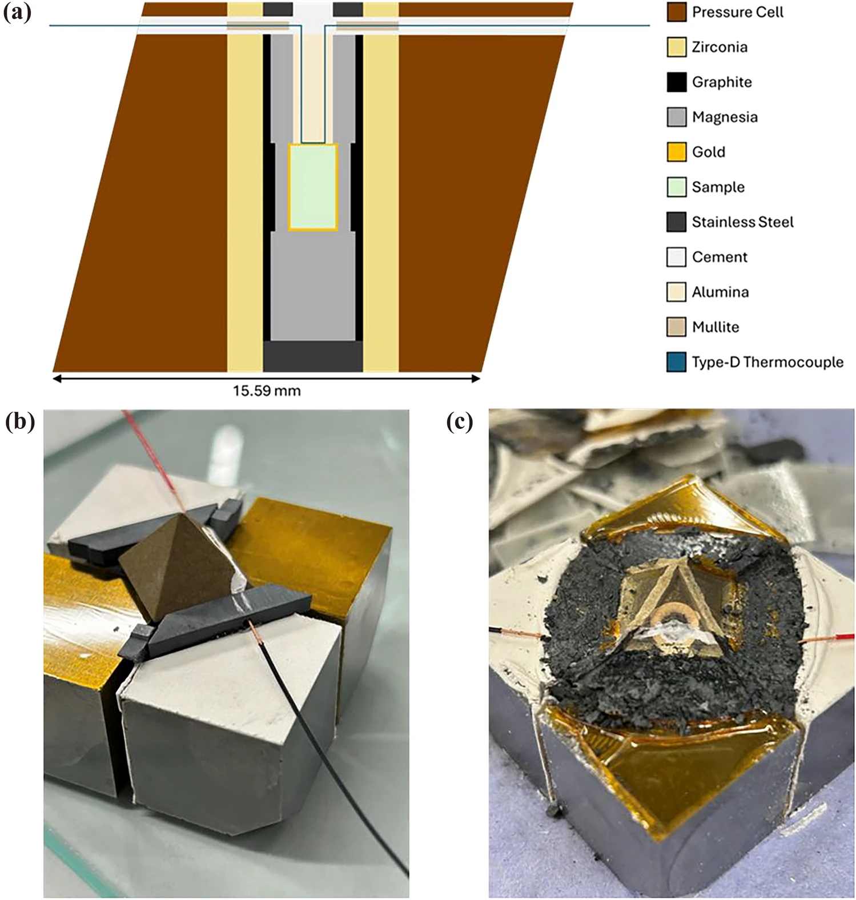

***Figure:*** ***a** An illustration depicting the cross-section of the high-pressure cell design used to conduct hot-pressing experiments. In three dimensions, the high-pressure cell is a regular octahedron with edge lengths of 18 mm. **b** A fully assembled high-pressure cell sitting in four truncated tungsten-carbide anvils. The thermocouple wires extruding the high-pressure cell are wound with copper wire and threaded through holes drilled into pyrophyllite gaskets. The anvils are electrically isolated using yellow insulation tape and white cardboard paper. Four more anvils with gaskets and electrical insulation are placed directly on top of this assembly prior to conducting hot-pressing experiments. **c** A post-experiment high-pressure cell. The triangular face shown is looking top-down at the high-pressure cell in Fig. 1a. The tops of the zirconia annulus, crescent-shaped stainless-steel disc, and alumina-based cement are visible.*

## Download

- [Online](https://link.springer.com/article/10.1007/s10853-026-13008-z)
- [Paper](paper.pdf)

## Abstract

Olivine-structured lithium-metal-phosphates ($\alpha$-LiMPO$_4$, where M = Fe, Ni, Co, Mn) are established or prospective cathode materials for lithium-ion batteries. At high pressures (P, in GPa) and temperatures (T, in $^{\circ}$C), the electrochemically active $\alpha$-LiFePO$_4$, $\alpha$-LiNiPO$_4$, and $\alpha$-LiCoPO$_4$ undergo a solid-state phase transition to an electrochemically less active or inactive Cmcm ($\beta$) orthorhombic structure. This phase delineation in P--T space is significant because it differentiates between $\alpha$ and $\beta$ phases and constrains boundary conditions for the synthesis of these cathode materials. To date, pressure--temperature phase diagrams showing this delineation in P--T space, either via theoretical investigations or experimental results, have not been reported for any of the LiMPO$_4$ cathode materials. In this work, we conducted experiments on $\alpha$-LiMnPO$_4$ up to 8 GPa and 1113 $^{\circ}$C in a large-volume hydraulic press. Using *ex situ* X-ray diffraction and Raman spectroscopy, we determined the high P--T phase to be a $\beta$ structure (a = 5.5465(3) $\mathrm{ \AA}$, b = 8.4110(6) $\mathrm{ \AA}$, c = 6.2990(4) $\mathrm{ \AA}$) and reported the first phase diagram up to 9 GPa and 1200 $^{\circ}$C. A linear Clapeyron relation was determined to be -3.15 MPa $^{\circ}$C and predicted a room-temperature $\alpha \rightarrow \beta$ transition at $\sim$ 8.2 GPa.

## Acknowledgement

JAHL acknowledges the technical support from Andrij Zadoroshnyk, the Raman spectroscopy technical specialist in the Department of Materials, University of Manchester. SAH acknowledges the UKRI Natural Environment Research Council for funding support (NE/L006898, NE/P017525). AJME acknowledges the support by a UKRI Engineering and Physical Sciences Research Council scholarship (EP/W524347/1). We thank the two anonymous reviewers for their constructive criticisms and discussions that helped improve the quality of this manuscript.

## Data Availability

All data generated or analysed during this study are included in this published article and its supplementary information files. Additionally, a crystallographic information file (.cif) containing all crystallographic information of the β-LiMnPO4 is available in the Figshare repository, [https://doi.org/10.48420/32186136.v1](https://doi.org/10.48420/32186136.v1).

---

## Citation

```latex
@article{littleton2026determination,
  title={Determination of the high-pressure--temperature phase of LiMnPO4 energised by battery applications},
  author={Littleton, Joshua AH and Evans, Andrew JM and Neukampf, Julia and McElhinney, Tara R and Hunt, Simon A},
  journal={Journal of Materials Science},
  volume={61},
  number={28},
  pages={20189--20201},
  year={2026},
  publisher={Springer},
  doi={10.1007/s10853-026-13008-z}
}
```
