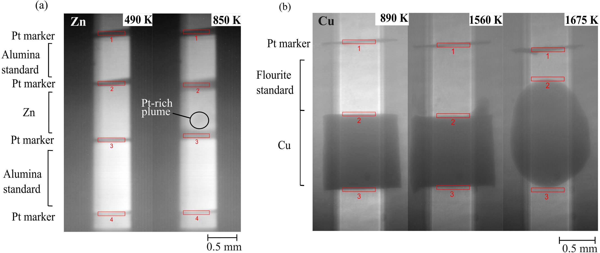

***Figure:*** *X-radiograph images of experiments, each sample is ~1 mm in length in the first image. The red boxes represent highlighted regions of interest for data processing. (a) Zn experiment before melting at 490 K and after melting at 850 K. The dark patch above the box 3 at 850 K is a plume of molten Pt in the Zn sample, and (b) Cu experiment before melting at 890 K, at the onset of melting at 1560 K, and fully molten at 1675 K.*

## Abstract

There is an absence of high pressure experimental data relevant to seismology on metals and alloys close to the liquidus, which hampers our understanding of the composition and structure of the Earth’s inner core. Here, we address this by performing high-pressure cyclic deformation experiments on hexagonal close-packed zinc and face-centred cubic copper up to melting, as analogues for iron. Samples, together with an elastic reference, were heated to the liquidus at 3--4 GPa while simultaneously being subjected to cyclic deformation at strains of $10^{-4}$--$10^{-5}$ at frequencies of 0.1--0.3 Hz. X-radiographs were used to monitor changes in sample length throughout the experiments, from which $E_\omega$ (the finite-frequency Young’s modulus) was derived. We report a phenomenon in which both samples exhibit significant softening under approximately constant stress amplitudes at homologous temperatures above $\sim 0.85$. Softening is consistent with previous experimental reports of rapid recrystallization in metals. The alignment of $E_\omega$ with the minimum elastic Young’s modulus suggests that small sinusoidal stresses may have the ability to induce a preferred orientation in metals near the liquidus.

## Acknowledgement

The authors thank the two anonymous reviewers for their helpful discussions and constructive criticism which greatly improved this manuscript. T.R.M was supported by an EPSRC DTA, and NERC grant NE/V018272/1. O.T.L. was supported by the Royal Society in the form of a University Research Fellowship (UF150057). S.A.H. was supported by NERC grants NE/H016309, NE/L006898 NE/P017525 and NE/V018272/1.

## Data Availability

Data will be made available on request.

---

## Citation

```latex
@article{mcelhinney2026viscoelastic,
  title={Viscoelastic softening of copper and zinc at high homologous temperatures under seismic-frequency cyclic loading},
  author={McElhinney, Tara R and Walker, Andrew M and Pamato, Martha G and Lord, Oliver T and Ezad, Isra S and Hunt, Simon A},
  journal={Physics of the Earth and Planetary Interiors},
  pages={107608},
  year={2026},
  publisher={Elsevier},
  doi={10.1016/j.pepi.2026.107608}
}
```
